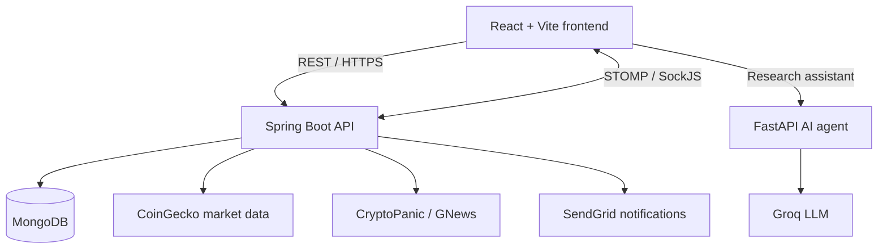
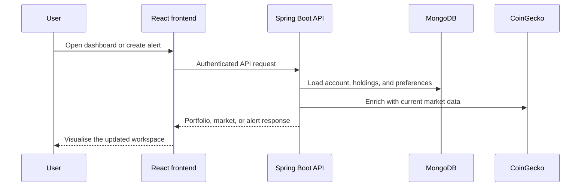
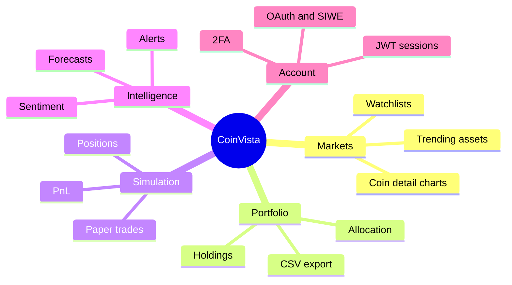

# CoinVista

<p align="center">
  
</p>

<p align="center"><strong>A full-stack crypto intelligence workspace for researching markets, tracking portfolios, and practicing decisions without risking capital.</strong></p>

<p align="center">
  
  
  
</p>

## Why CoinVista?

CoinVista brings market discovery, watchlists, portfolio analytics, paper trading, alerts, and experimental intelligence signals into one focused workspace. It is designed as a portfolio-grade SaaS project, but its simulated-trading experience also makes it a useful sandbox for crypto research.

> **Educational use only.** CoinVista does not provide investment advice. Market data and intelligence signals should not be treated as a recommendation to buy or sell an asset.

## Highlights

| Explore | Practice | Understand | Protect |
| --- | --- | --- | --- |
| Live market discovery and coin charts | Paper-trading ledger and virtual cash | Forecast, sentiment, anomaly, and news panels | JWT sessions, refresh rotation, 2FA, privacy controls |
| Saved watchlists and price alerts | Strategy-builder and backtesting foundations | Portfolio allocation, PnL, and CSV export | OAuth, SIWE/web3 hooks, and encrypted holding fields |

## Architecture



### Request lifecycle



## Tech stack

- **Frontend:** React 18, Vite, Tailwind CSS, DaisyUI, Framer Motion, Chart.js, RainbowKit/Wagmi
- **Backend:** Java 17, Spring Boot 3.2, Spring Security, Spring Data MongoDB, WebSocket/STOMP
- **Agent service:** Python, FastAPI, LangChain/LangGraph, Groq
- **Infrastructure:** Docker Compose, MongoDB

## Project structure

```text
CoinVista/
├── frontend/       # React user interface and design system
├── backend2/       # Spring Boot REST API, security, jobs, and WebSockets
├── agent/          # FastAPI research assistant service
├── scripts/        # Offline dataset and model experimentation utilities
├── docker-compose.yml
└── ARCHITECTURE.md # Detailed domain and request-flow notes
```

## Quick start

### Prerequisites

- Node.js 18+ and npm
- Java 17+ and Maven 3+
- Python 3.9+
- MongoDB (local or Atlas)
- Docker Desktop (optional, for Compose)

### 1. Configure environment variables

Create `.env` in the repository root. The backend reads the database, security, market, and optional integration values below.

```dotenv
MONGODB_URI=mongodb://127.0.0.1:27017/coinvista
JWT_SECRET=replace-with-a-long-random-secret
JWT_ACCESS_EXPIRATION=900000
JWT_REFRESH_EXPIRATION=2592000000
ENCRYPTION_KEY=replace-with-a-64-character-hex-key
REFRESH_COOKIE_NAME=coinvista_refresh
FRONTEND_URL=http://localhost:3000
API_BASE_URL=http://localhost:5000
CORS_ORIGINS=http://localhost:3000
COINGECKO_API_KEY=your_key
AGENT_URL=http://localhost:8000

# Optional integrations
GROQ_API_KEY=
CRYPTOPANIC_API_KEY=
GNEWS_API_KEY=
SENDGRID_API_KEY=
MAIL_FROM=
STRIPE_SECRET_KEY=
STRIPE_WEBHOOK_SECRET=
GOOGLE_CLIENT_ID=
GOOGLE_CLIENT_SECRET=
GITHUB_CLIENT_ID=
GITHUB_CLIENT_SECRET=
FACEBOOK_CLIENT_ID=
FACEBOOK_CLIENT_SECRET=
```

Never commit this file or real credentials.

### 2. Run locally

Open three terminals from the repository root:

```bash
# Frontend — http://localhost:3000
cd frontend
npm install
npm run dev
```

```bash
# API — http://localhost:5000
cd backend2
mvn spring-boot:run
```

```bash
# Optional AI agent — http://localhost:8000
python -m venv .venv
# Windows: .\.venv\Scripts\activate
# macOS/Linux: source .venv/bin/activate
pip install -r agent/requirements.txt
python agent/main.py
```

### Docker Compose

When Docker Desktop is running and `.env` is configured:

```bash
docker compose up --build
```

The frontend is exposed on `http://localhost:3000`, API on `http://localhost:5000`, and agent on `http://localhost:8000`.

## Available scripts

| Location | Command | Purpose |
| --- | --- | --- |
| `frontend/` | `npm run dev` | Start the Vite development server |
| `frontend/` | `npm run build` | Produce a production frontend build |
| `frontend/` | `npm run lint` | Run ESLint across the frontend |
| `backend2/` | `mvn spring-boot:run` | Start the API locally |
| `scripts/` | `python generate_sample_data.py` | Generate sample data for offline experimentation |

## Product map



## Security notes

- Access tokens are held in memory; refresh sessions use an HTTP-only cookie flow.
- Refresh-session rotation, JWT verification, 2FA, and OAuth handoffs live in `backend2/`.
- Sensitive holding values support encrypted persistence. Configure a strong `ENCRYPTION_KEY` outside source control.
- Billing, social login, news, and AI capabilities are optional integrations; their keys can remain unset during UI development.

## Documentation

- [Architecture guide](ARCHITECTURE.md) — domain model, modules, integrations, and detailed request flows.
- [Backend notes](backend2/README.md) — backend-specific information.

## Contributing

1. Fork the repository and create a focused branch.
2. Keep changes scoped and add tests where practical.
3. Run `npm run lint` and `npm run build` from `frontend/` before opening a pull request.
4. Describe user-visible changes, configuration needs, and any API impact in the pull request.

## License

No license has been specified for this repository yet. Add a `LICENSE` file before publishing or accepting external contributions.
